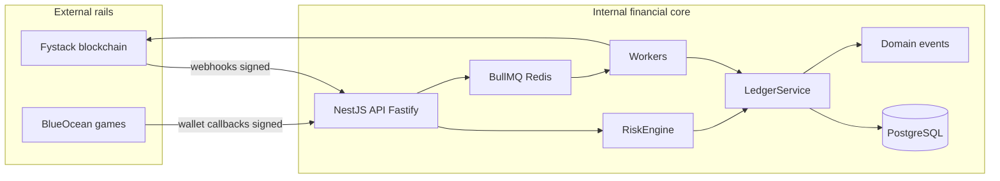

# Enterprise crypto casino — financial operating system (FOS)

**Status:** Reference architecture + **implementable** baseline in [`apps/financial-core`](../apps/financial-core/) (NestJS + Fastify + Prisma + BullMQ).  
**Rule:** Fystack and BlueOcean are **settlement / game event rails**. **Only the internal ledger** is the balance and revenue-authority.

---

## Table of contents

1. [Full system architecture](#1-full-system-architecture)  
2. [Module architecture (NestJS)](#2-module-architecture-nestjs)  
3. [Database schema](#3-database-schema)  
4. [Ledger system](#4-ledger-system)  
5. [Event system](#5-event-system)  
6. [Queue system (BullMQ)](#6-queue-system-bullmq)  
7. [Workers](#7-workers)  
8. [Deposit system](#8-deposit-system)  
9. [Withdrawal system](#9-withdrawal-system)  
10. [Treasury system](#10-treasury-system)  
11. [Risk system](#11-risk-system)  
12. [Fraud system](#12-fraud-system)  
13. [BlueOcean integration](#13-blueocean-integration)  
14. [Wagering engine](#14-wagering-engine)  
15. [Bonus engine](#15-bonus-engine)  
16. [VIP system](#16-vip-system)  
17. [Cashback and rakeback](#17-cashback-and-rakeback)  
18. [Challenge system](#18-challenge-system)  
19. [Reconciliation system](#19-reconciliation-system)  
20. [Analytics system](#20-analytics-system)  
21. [Admin system](#21-admin-system)  
22. [Security system](#22-security-system)  
23. [Idempotency system](#23-idempotency-system)  
24. [Replay system](#24-replay-system)  
25. [Deployment architecture](#25-deployment-architecture)  
26. [End-to-end synthesis](#26-end-to-end-synthesis)

---

## 1. Full system architecture

### What it is

A **modular monolith**: one deployable API process + separate **worker** processes (same codebase) consuming BullMQ queues, sharing **one PostgreSQL** database. External systems plug in via **ports/adapters** (Fystack wallet provider, BlueOcean game provider).

### Why it exists

Operators need **one** auditable book of record, **deterministic** money flows, and **replaceable** vendors without rewriting core logic.

### How it fits together



### What depends on it

Player apps, admin apps, CRM, BI exports (read replicas), alert webhooks.

### What it depends on

Postgres, Redis, secrets manager, observability (OpenTelemetry), KMS/HSM for treasury keys (production).

### Configuration

- `FINANCIAL_CORE_DATABASE_URL`, `FINANCIAL_CORE_REDIS_URL`, provider keys via env or vault references; **never** commit secrets.

### Failure modes

Split brain between two databases; **prevented** by single DB. Vendor API down: **queue + retry**, ledger unchanged until confirm.

### Tests required

Property tests for balanced postings; idempotency replay; contract tests for adapters.

### If built wrong

**Dual writes** to ledger + `users.balance`, or provider balance treated as truth → **irrecoverable** accounting corruption.

---

## 2. Module architecture (NestJS)

| Module | Responsibility |
|--------|----------------|
| `LedgerModule` | Double-entry postings, account factory, balance projection |
| `RiskModule` | `evaluate()` gates money movement |
| `DepositsModule` | Ingest Fystack events → risk → ledger → enqueue sweep |
| `WithdrawalsModule` | State machine + ledger locks + Fystack payout |
| `WageringModule` | BlueOcean bet/win/void orchestration, cash-first |
| `BonusModule` | State machine + WR tracking + conversion jobs |
| `VipModule` | Tier, points, schedules |
| `ChallengesModule` | Rules + progress from wager events |
| `TreasuryModule` | Hot/treasury thresholds, sweeps |
| `ReconciliationModule` | Solvency checks, alerts |
| `AnalyticsModule` | Read models / materialized views from ledger |
| `AdminModule` | RBAC, audit, manual adjustment API |
| `IntegrationsFystackModule` | `WalletProvider` implementation |
| `IntegrationsBlueOceanModule` | `GameProvider` implementation |
| `QueueModule` | BullMQ registration (`src/queue`) |

**Dependency rule:** Integration modules depend on **domain modules**, never the reverse.

---

## 3. Database schema

Prisma schema: [`apps/financial-core/prisma/schema.prisma`](../apps/financial-core/prisma/schema.prisma).

### Table: `fc_users`

| Column | Purpose |
|--------|---------|
| `id` | UUID PK — identity anchor for player accounts |
| `email` | Login identifier |
| `created_at` | Audit |

**Indexes:** unique email.  
**Mutable:** yes (operational).  
**Financial:** no (no balances).  
**Example row:** `(uuid, 'player@example.com', now())`.  
**Flows:** bonus/challenge/VIP FK references.

### Table: `fc_ledger_accounts`

| Column | Purpose |
|--------|---------|
| `id` | UUID PK |
| `type` | `LedgerAccountType` — chart of accounts |
| `user_id` | Nullable — null for system pools |
| `currency` | ISO-like code (USDT, USD, …) |
| `scope_key` | **Unique** stable key: `user:{uuid}:USER_CASH:USDT` or `system:CASINO_REVENUE:USDT` |
| `created_at` | Immutable anchor time |

**Indexes:** `scope_key` unique; `(type, currency)`.  
**Append-only:** rows **never deleted**; chart extensions add new accounts.  
**Financial:** yes — **identity** of buckets; **balance** is **not** stored.  
**Example:** `scope_key = user:…:USER_CASH:USDT`.

### Table: `fc_ledger_transactions`

| Column | Purpose |
|--------|---------|
| `id` | UUID PK |
| `idempotency_key` | **Unique** business key — replay safety |
| `correlation_id` | Trace across services |
| `metadata` | JSON context |
| `created_by` | Admin/system actor |
| `created_at` | Immutable |

**Append-only:** never UPDATE/DELETE.  
**Financial:** yes — posting header.

### Table: `fc_ledger_entries`

| Column | Purpose |
|--------|---------|
| `transaction_id` | FK header |
| `account_id` | FK account |
| `amount` | **Positive** `Decimal(38,18)` |
| `side` | DEBIT or CREDIT |
| `line_type` | Business classification (`BET_DEBIT`, …) |
| `reference_id` / `reference_type` | Bet id, withdrawal id, bonus id |
| `line_number` | Stable ordering within txn |
| `metadata` | JSON — odds, game id, sport |

**Constraint (application + optional DB check):** per `transaction_id`, sum(debits) = sum(credits).  
**Append-only:** **immutable** forever.

### Table: `fc_domain_events`

Immutable **business** events for projections/replay. Optional `idempotency_key` unique.

### Table: `fc_processed_callbacks`

Webhook dedup store: `provider` + `idempotency_key` unique; optional `response_body` cache for HTTP replay.

### Table: `fc_risk_events`, `fc_audit_log`

Append-only operational/compliance records.

### Table: `fc_withdrawal_requests` + `fc_withdrawal_events`

Stateful workflow + append-only transition log.

### Table: `fc_bonus_instances`

Mutable **operational** bonus row (WR progress); **money** still flows through ledger; instance tracks interpretation.

### Table: `fc_reconciliation_alerts`

Mutable resolution workflow **after** human review (alert row updated); ledger never touched for “fixes” without new postings.

---

## 4. Ledger system

### What it is

**Double-entry:** every `LedgerTransaction` has ≥2 `LedgerEntry` lines; debits = credits in major units.

### Implementation

- `LedgerService.postTransaction` — validates balance, idempotent by `idempotency_key`, wraps optional **domain events** in same DB transaction.
- `assertDoubleEntryBalanced` — pure validation (unit tested).

### Balances

`getBalance(accountId)` = **sum(CREDIT amounts) − sum(DEBIT amounts)** with sign convention documented per account type (user liability vs revenue).

### Why append-only

Audit, replay, regulatory examination, forensic reconstruction.

### Tests

- Unbalanced rejection  
- Idempotent retry returns same transaction  
- Concurrent postings with serializable isolation where needed  

### If built wrong

Posting single-sided lines or storing balances on `users` → **instant integrity loss**.

---

## 5. Event system

### Storage

`fc_domain_events` — **insert-only**. Payload includes `schema_version`.

### Flow

1. Ledger commit succeeds in TX.  
2. Insert domain event row(s) **same TX** (never emit before commit).  
3. Optionally publish to Redis pub/sub for real-time (at-least-once); consumers **dedupe** by event id.

### Replay

Workers rebuild projections by `occurred_at` order per aggregate; **idempotent** handlers using ledger + event keys.

---

## 6. Queue system (BullMQ)

### Queues (constants)

See [`queue.constants.ts`](../apps/financial-core/src/queue/queue.constants.ts): `deposits`, `withdrawals`, `treasury`, `wagering`, `bonus`, `vip`, `cashback`, `rakeback`, `challenges`, `reconciliation`, `analytics`, `risk`.

### Job structure

```json
{
  "jobId": "uuid",
  "idempotencyKey": "job:deposit:settled:0xabc…",
  "payload": { },
  "schemaVersion": 1
}
```

### Retries / DLQ

Default: **5 attempts**, exponential backoff. Failed jobs → **dead-letter** queue or `failed` set with alert; **never** lose financial intent — reconcile against DB.

### Idempotency

Job **enqueue** checks Redis SETNX or DB row “job dedupe” before push; handler checks **business** idempotency on ledger.

### Concurrency

Per-queue worker concurrency tuned by CPU/DB; financial jobs often **serial per user** via **partition key** (BullMQ job group / Redis lock).

### Monitoring

Queue depth, oldest job age, failure rate, DLQ count; PagerDuty on reconciliation CRITICAL.

---

## 7. Workers

| Worker pool | Consumes | Does |
|-------------|----------|------|
| Deposits | `deposits` | Confirm chain → risk → ledger credit |
| Withdrawals | `withdrawals` | State transitions → Fystack broadcast |
| Treasury | `treasury` | Sweeps, gas top-ups |
| Bonus | `bonus` | Activation, conversion, expiry |
| VIP / cashback / rakeback | respective queues | Scheduled + event-driven accrual |
| Reconciliation | `reconciliation` | Solvency, orphan detection |
| Analytics | `analytics` | Rollups to reporting tables |

Workers **only** call domain services; **no** money logic inlined in job file beyond orchestration.

---

## 8. Deposit system

### Step-by-step

1. **Detection:** Fystack webhook / indexer notifies `deposit_detected` → enqueue **deposits** job with `idempotency_key = chain:tx_hash:log_index`.  
2. **Confirmation:** Wait `N` confirmations; handle **reorgs** by marking superseded detection events **non-financial** — **no ledger** until stable policy satisfied.  
3. **Risk:** `RiskEngine.evaluate(DEPOSIT)` — velocity, sanctions list, source clustering.  
4. **Ledger:** `DEPOSIT` credit `USER_CASH`, debit `TREASURY_ASSET` (or intercompany per chart).  
5. **Event:** `deposit_confirmed`.  
6. **Treasury sweep:** if policy moves funds hot→treasury → enqueue **treasury** job.

### Edge cases

| Case | Handling |
|------|----------|
| Duplicate webhook | `processed_callbacks` returns cached 200 |
| Reorg | Invalidate pending intent; no ledger until stable |
| Wrong network | Reject in adapter; no ledger |
| Replay | Idempotency key includes chain position |

---

## 9. Withdrawal system

### State machine

`REQUESTED → RISK_REVIEW → APPROVED → LEDGER_LOCKED → QUEUED → SIGNING → BROADCAST → CONFIRMED → FINALIZED` (+ `REJECTED`, `FAILED`).

### Locking

**Ledger:** move `USER_CASH` → `USER_PENDING_WITHDRAWAL` (balanced against liability account) on approval path — **never** subtract silently.

### Failures

**Broadcast failure:** retry with backoff; after threshold → `FAILED`, funds remain locked until manual resolution posts **reversal** entries.

### Reconciliation

Match `PENDING_WITHDRAWAL` sum to open withdrawals; match chain confirms to `CONFIRMED`.

---

## 10. Treasury system

### Hot vs cold

**Hot:** operational payout signing; **cold:** majority of funds; policy-defined.

### Liquidity

Threshold triggers **sweep** jobs; gas wallets fed by micro-transfers (queued, rate-limited).

### Configuration

Per-asset min hot balance, max single payout, daily outbound cap.

---

## 11. Risk system

### When it runs

**Before any ledger write** (deposit credit, bet, bonus grant, withdrawal lock).

### Output

`ALLOW | BLOCK | REVIEW` + score + reasons → **immutable** `fc_risk_events`.

### Checks

Velocity, multi-account signals, bonus abuse patterns, withdrawal velocity vs wagering, IP/device intelligence.

---

## 12. Fraud system

**Risk** = gate on actions; **fraud** = investigation workflows (case management, chargeback hooks). Financial postings **still** only via ledger; fraud tools **flag** users and block **new** risk-approved actions.

---

## 13. BlueOcean integration

### Handlers

| Callback | Action |
|----------|--------|
| Balance | `LedgerService` sum **USER_CASH** (+ policy for bonus play) — read-only |
| Bet | **Cash-first** stake split → `BET_DEBIT` / `SPORTSBOOK_BET_DEBIT` + revenue line |
| Win | `WIN_CREDIT` + revenue reversal partial |
| Rollback | Opposite entries; same idempotency namespace |

### Rules

- HMAC/signature verify  
- `processed_callbacks` dedup  
- Idempotency `round_id + action`  
- **Never** trust provider balance  

---

## 14. Wagering engine

Computes **eligible stake** for bonus WR from ledger-classified bet events; applies **game weights** and **sports** rules (min odds, excluded markets). Emits `wager_recorded` for VIP/challenges.

---

## 15. Bonus engine

**States:** CREATED → ACTIVE → WAGERING → COMPLETED → CONVERTED | EXPIRED | FORFEITED.

- **Grant:** ledger `BONUS_EXPENSE` / `USER_BONUS` lines + instance row.  
- **WR tracking:** `wagered_toward_requirement` updated on events; conversion worker posts **conversion** txn.  
- **Expiry/forfeit:** ledger reversals + status.

---

## 16. VIP system

Tier config in DB or versioned config; points from **ledger-classified** wager volume; tier change → `vip_tier_changed` event; cashback/rakeback rates **read** from tier table.

---

## 17. Cashback and rakeback

Periodic workers: compute from **ledger** activity (NGR components); post `CASHBACK_EXPENSE` / `USER_CASHBACK`, etc. **Schedule:** cron via BullMQ repeatable jobs.

---

## 18. Challenge system

Define targets (volume, sport, game type). Progress updated from **same wager events** as WR. Completion → `CHALLENGE_REWARD` ledger posting.

---

## 19. Reconciliation system

**Checks:**  
- User liabilities sum vs treasury on-chain (via Fystack)  
- Pending withdrawals vs `USER_PENDING_WITHDRAWAL`  
- Bonus liability vs `USER_BONUS` + open bonuses  

**On mismatch:** insert `fc_reconciliation_alerts` **CRITICAL**; **no auto ledger fudge**.

---

## 20. Analytics system

**All** KPIs from **ledger_entry** joins:

| Metric | Definition |
|--------|------------|
| GGR | Stakes − wins (by line types, net voids) |
| NGR | GGR − bonus expense − cashback − rakeback − VIP − affiliate − jackpot contrib (policy) |
| FTD | First confirmed `DEPOSIT` line per user after risk pass |
| ARPU | NGR / active users (define active = wager or login policy) |
| LTV | Cumulative NGR (or NGR−costs) since FTD |

---

## 21. Admin system

- **Read:** same queries/modules as player-facing balance/history, scoped by RBAC.  
- **Write:** manual adjustment → `MANUAL_ADJUSTMENT` **ledger** + `fc_audit_log`.  
- **Never** raw SQL balance updates.

---

## 22. Security system

- **RBAC:** roles/permissions on every admin route.  
- **Webhook:** signature + timestamp skew + replay table.  
- **Treasury:** MPC/HSM policy (production); separate signing service.  
- **mTLS** internal between API and workers optional.

---

## 23. Idempotency system

Layers: HTTP idempotency-key → `LedgerTransaction.idempotency_key` → `processed_callbacks` → job enqueue dedupe. **Same key = same economic effect**.

---

## 24. Replay system

- **Ledger:** deterministic from entries.  
- **Events:** rebuild read models from `fc_domain_events`.  
- **Callbacks:** return cached body from `fc_processed_callbacks`.

---

## 25. Deployment architecture

- **API:** horizontally scaled stateless containers; **single** Postgres primary; replicas for read-only analytics.  
- **Redis:** HA (sentinel/cluster).  
- **Workers:** separate deployment; scale per queue.  
- **Migrations:** goose-style or Prisma migrate **before** rollout; backwards-compatible phases.

---

## 26. End-to-end synthesis

### How the whole system works

**Deposit:** rail detects → risk → ledger credit → events → optional sweep.  
**Play:** BlueOcean bet → risk → **cash-first** ledger stakes → bonus/VIP/challenges consume events.  
**Withdraw:** request → risk → lock in ledger → payout rail → confirm → finalize ledger movement off pending.  
**Reconciliation:** periodic workers prove **liabilities + revenue** match rail reality.

### What the operator sees

Admin dashboards **match** ledger analytics; alerts on mismatch; full audit trail.

### What the player sees

Balances/transaction history from **same** ledger projections; **no** phantom funds.

### Why this is safe

- Balances are **derived** — no silent mutation.  
- Double-spend prevented by **idempotent** keys + **stable** chain confirmation policy.  
- Duplicates are **no-ops** economically.  
- **Auditable** immutable ledger + events.  
- **Scalable** via queue partitioning and read replicas.

### What breaks if built wrong

| Failure | Consequence |
|---------|-------------|
| Provider balance trusted | Total loss of integrity |
| Direct balance column | Silent theft / bugs |
| Unbalanced postings | Accounting nonsense |
| Events before ledger | False notifications & bad projections |
| Auto-reconcile without human over threshold | Regulatory & trust disaster |

### Where most casino systems fail

Dual accounting (CRM vs ledger), **bonus** off-ledger, **manual** SQL fixes, **webhook** replays without idempotency, **withdrawal** without proper locking.

---

## Code map (implemented baseline)

| Path | Contents |
|------|----------|
| `apps/financial-core/prisma/schema.prisma` | Double-entry schema |
| `apps/financial-core/src/ledger/ledger.service.ts` | Posting + idempotency |
| `apps/financial-core/src/queue/` | BullMQ queue registration |
| `apps/financial-core/src/events/` | Domain event helpers |

**Next implementation slices:** `WageringModule` (BlueOcean), `DepositsModule` / `FystackAdapter`, `WithdrawalsModule` state machine, `BonusModule` WR worker, `ReconciliationModule` scheduler.

---

*This document is the operator-facing contract for engineering implementation; update it when schema or invariants change.*
